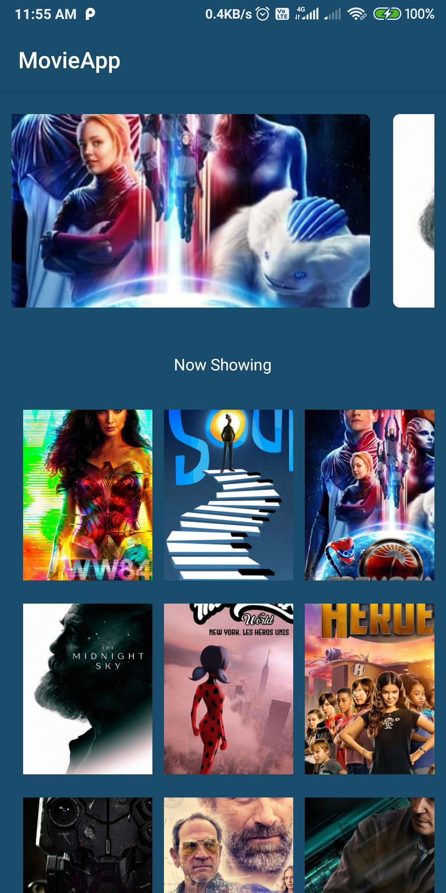
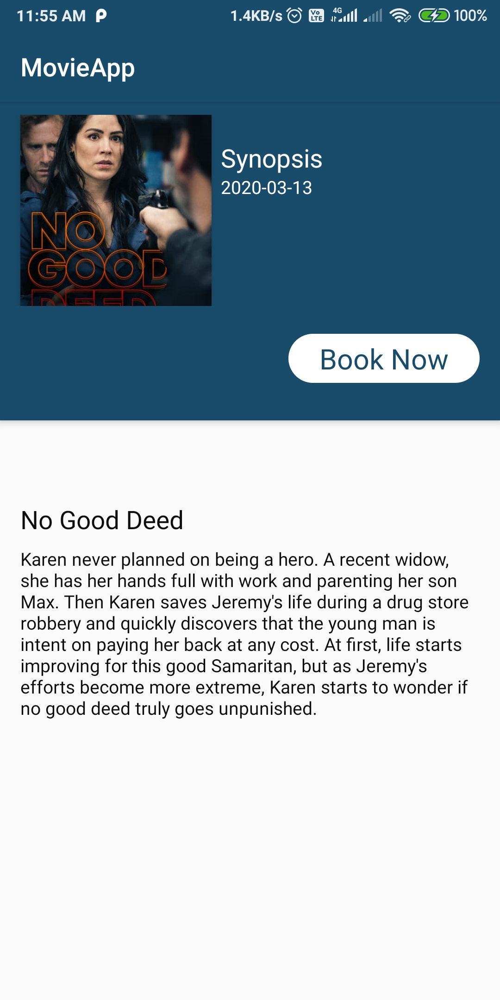

# MovieApp

## Additional info:
* Language: Kotlin
* UI Layer: MVVM
* Data Layer: Repository
* Dependecy Injection: HILT
* Http Requests: Retrofit2
* Async requests: Rxjava2
<h1>Simple Working</h1>

  # Movie List Screen

  &nbsp &nbsp &nbsp &nbsp &nbsp &nbsp &nbsp &nbsp &nbsp &nbsp &nbsp &nbsp &nbsp &nbsp &nbsp &nbsp
  # Movie Details Screen
  

